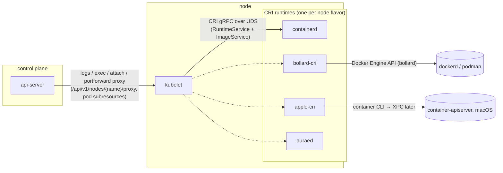

# CRI Redesign — Plan Overview

## Progress tracker

Checked = stage acceptance criteria met (see per-plan Status sections for detail).

- [x] **01 `cri-proto` / `cri-server`** — [x] S1 · [x] S2 · [x] S3 · [x] S4 *(done 2026-07-17)*
- [ ] **02 kubelet CRI-only** — [x] K1 · [x] K2 · [x] K3 · [x] K4 · [x] K5 · [x] K6 · [ ] K7 *(K2/K4/K5 runtime-verified on containerd — exec stdout/stderr/exit-code/stdin + 20× no-1005; K7 blocked on kube-proxy networking)*
- [ ] **03 `bollard-cri`** — [x] B1 · [x] B2 · [x] B3 · [x] B4 · [x] B5 · [ ] B6
- [ ] **04 `apple-cri` (CLI)** — [ ] A1 · [ ] A2 · [ ] A3 · [ ] A4 · [ ] A5
- [ ] **05 `apple-cri` XPC migration** — [ ] X1 · [ ] X2 · [ ] X3 · [ ] X4 · [ ] X5
- [ ] **06 testing/environments** — [ ] lima VM config checked in · [ ] critest harness scripted · [ ] CI wiring
- [ ] **10 get rid of SPDY** — [ ] G1 · [ ] G2 · [ ] G3 · [ ] G4 · [ ] G5 *(SPDY as a default-on, deprecate-able crate feature; runtimes not WS-ready — see [10](10-get-rid-of-spdy.md))*

Rusternetes' kubelet currently drives Docker/Podman directly through bollard.
This plan set redesigns the kubelet to speak **only the Kubernetes CRI**
(Container Runtime Interface, gRPC over a unix socket) and introduces reusable
CRI crates so that multiple runtime backends — containerd, a bollard/Docker
shim, an Apple Containers shim, and aurae — can serve the same kubelet.

## Why

1. **Conformance.** A prior certified-conformance run (K8s v1.35, 2-node Podman
   cluster on macOS) sat at ~63.6% with 90 failed specs. ~74% of those trace to
   two structural gaps: synthetic pod logs (~53 specs) and broken exec/attach
   websocket streaming (~17 specs). Both are fixed *by construction* in a CRI
   kubelet: CRI runtimes write real log files the kubelet serves, and CRI
   defines the exec/attach/portforward streaming architecture. See
   [06-testing-and-environments.md](06-testing-and-environments.md) for the
   traceability table.
2. **Compliance.** Upstream Kubernetes removed dockershim; the kubelet speaks
   only CRI, and Docker support lives in an external shim (cri-dockerd). We
   adopt the same shape.
3. **Reuse.** The hard, runtime-agnostic pieces (proto bindings, the SPDY
   streaming server, log-format handling, checkpoint store) should exist once,
   in crates other projects can adopt.

## Target architecture

Key changes from today:

- The kubelet no longer links bollard. It dials `--container-runtime-endpoint`
  (UDS) and uses the CRI `RuntimeService`/`ImageService`.
- The api-server no longer opens the Docker socket for logs (the synthetic-log
  fallback in `crates/api-server/src/handlers/pod_subresources.rs` is deleted).
  Pod `log`/`exec`/`attach`/`portforward` subresources proxy to the kubelet,
  which serves logs from CRI log files and proxies streams to the runtime's
  streaming server.
- Docker/Podman support moves into `bollard-cri`, an external CRI shim modeled
  on cri-dockerd. macOS-native support moves into `apple-cri`.

## Crate map

| Crate | Kind | Purpose | Plan |
|---|---|---|---|
| `crates/cri-proto` | lib | Vendored CRI v1.36 proto + tonic-generated client/server stubs, UDS helpers | [01](01-cri-crates.md) |
| `crates/cri-server` | lib | Reusable CRI server harness: backend traits, SPDY streaming server, CRI log format, checkpoint store, UDS bootstrap | [01](01-cri-crates.md) |
| `crates/kubelet` | bin | Rewritten runtime layer on `cri-proto` client; bollard deleted | [02](02-kubelet-cri-only.md) |
| `crates/bollard-cri` | bin | CRI shim over the Docker Engine API (Docker/Podman) | [03](03-bollard-cri.md) |
| `crates/apple-cri` | bin (macOS) | CRI shim over apple/container (CLI first, XPC later) | [04](04-apple-containers-cri.md), [05](05-apple-cri-xpc-migration.md) |

## Dependency rules (hard constraints)

1. **`cri-proto` and `cri-server` must not depend on any other workspace crate**
   (`rusternetes-common` included). They are destined for crates.io so that
   aurae — or anyone — can adopt them without touching rusternetes.
   Dependency direction: rusternetes may fork/adopt aurae code (Apache-2.0,
   keep attribution headers); **aurae must never gain a rusternetes dep.**
   Enforce in CI: `cargo tree -p cri-proto -p cri-server --edges normal` must
   contain no `rusternetes-*` crate.
2. `bollard-cri` and `apple-cri` depend on `cri-proto` + `cri-server` (and
   bollard / std process APIs respectively) — not on the kubelet.
3. The kubelet depends on `cri-proto` only (client side). It does not depend on
   `cri-server`.

## Decision log

| # | Decision | Rationale |
|---|---|---|
| D1 | Shared crates live in the rusternetes workspace, publishable, zero internal deps | Fast iteration now (rusternetes is fast-moving); aurae adoption later via crates.io, honoring the no-rusternetes-deps-in-aurae rule |
| D2 | Apple CRI ships on the `container` CLI first; XPC migration is a separate staged plan with regression tests | CLI is a stable 1.0 interface today; XPC (also stable/versioned since container 1.0.0) needs a Rust decoding layer worth de-risking separately |
| D3 | Kubelet: hard cutover to CRI-only (no bollard fallback period) | Cleaner diff; interim testing against containerd in a Linux VM; macOS compose workflow is restored by `bollard-cri` ([03](03-bollard-cri.md)) |
| D4 | CRI protos: vendored `release-1.36` + `tonic-build` (aurae's pattern), not the `k8s-cri` crate | Version lockstep with critest v1.36.0 and with aurae; no third-party maintainer in the loop |
| D5 | critest (kubernetes-sigs/cri-tools v1.36.0) is the conformance harness for every CRI server; containerd is the behavioral reference | See [06](06-testing-and-environments.md) |

## Reading order

1. [01-cri-crates.md](01-cri-crates.md) — the foundation crates (everything else builds on these)
2. [02-kubelet-cri-only.md](02-kubelet-cri-only.md) — the kubelet hard cutover
3. [03-bollard-cri.md](03-bollard-cri.md) — Docker/Podman shim (restores the macOS compose workflow)
4. [04-apple-containers-cri.md](04-apple-containers-cri.md) — Apple Containers shim (CLI backend)
5. [05-apple-cri-xpc-migration.md](05-apple-cri-xpc-migration.md) — CLI → XPC migration
6. [06-testing-and-environments.md](06-testing-and-environments.md) — harness, environments, traceability

Docs 01 and 02 are sequential (02 needs 01's client). Docs 03 and 04 can start
once 01 stage S2 lands and can proceed in parallel with 02. Doc 05 starts only
after 04 is critest-stable.

## Source material

- **aurae `cri` branch** (local checkout `../aurae`, Apache-2.0): vendored
  `api/cri/v1/release-1.36.proto`; `auraed/src/cri/streaming.rs` (SPDY/3.1
  streaming server, ~1,383 lines); `auraed/src/cri/seccomp.rs`;
  `auraed/src/cri/image_store.rs`; conformance harness under `hack/`.
- **cri-dockerd** (local checkout `../cri-dockerd`): `core/` (CRI↔Docker
  mapping, ~6k lines Go), `store/` (checkpointing), `streaming/`, `naming.go`.
- **PR #15** (`feat: Container Runtime Abstraction Layer`, closed): CLI-mapping
  catalog in `crates/kubelet/src/container_runtime/apple.rs` on branch
  `feature/container-runtime-abstraction`.
- **Conformance failure analysis** (this repo's redesign input): summarized in
  [06-testing-and-environments.md](06-testing-and-environments.md).
- apple/container 1.0.0 (stable CLI + versioned XPC), apple/containerization
  (vminitd gRPC over vsock), cri-tools releases (darwin-arm64 since v1.29).
